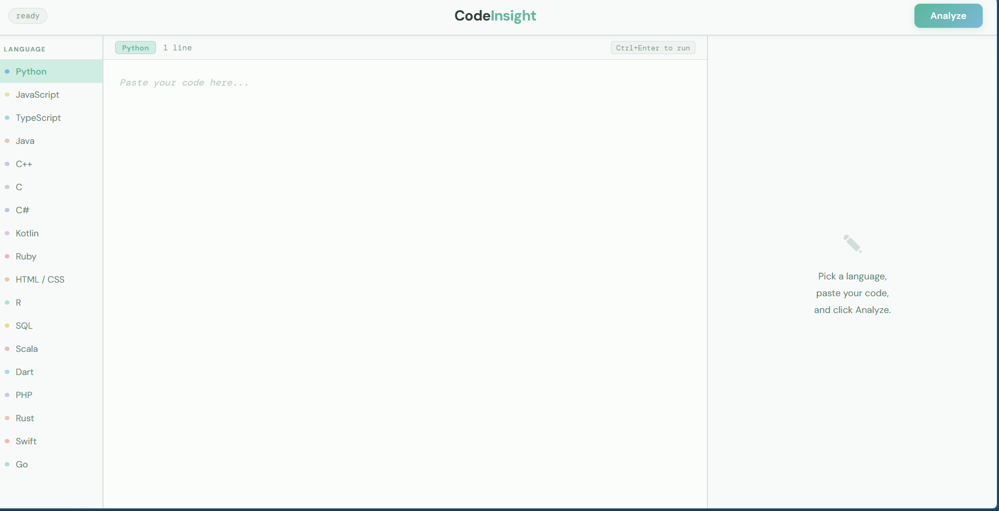
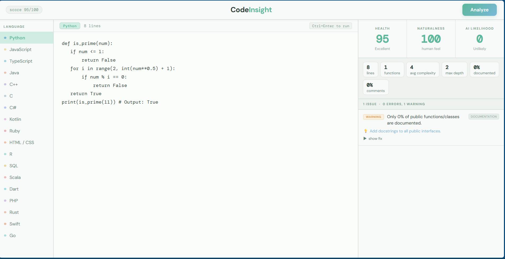

# CodeInsight — Multi-Language Code Analyzer

A static analysis tool that scores code quality, detects code smells, measures naturalness, and estimates AI-generated likelihood across **18 programming languages**.

Built with **Python + Flask**, using **AST parsing for Python** and **pattern-based heuristics** for all other languages.

---

## Screenshots

### Homepage


### Analysis Result


---

## Features

### Code Quality Scoring (0–100)
Every submission receives a weighted health score based on issue severity:

- Errors (−15 pts) → security vulnerabilities, unsafe patterns, syntax issues  
- Warnings (−5 pts) → code smells, missing documentation, complexity spikes  
- Info (−1 pt) → style inconsistencies and minor suggestions  

---

## Naturalness Score (0–100)

Measures how human-written code feels by analyzing:

- Descriptive vs generic variable names  
- Naming convention consistency  
- Blank line structure and code organization  
- Single-letter variable overuse outside loops  

---

## AI Likelihood Score (0–100)

Flags patterns often associated with AI-generated or copy-pasted code:

- Placeholder-heavy naming (`data`, `result`, `handler`)
- Boilerplate-style comments  
- Suspiciously uniform line lengths  
- Perfectly symmetrical function structures  
- Mixed naming conventions from merged sources  

---

## Per-Issue Fix Hints

Every detected issue includes:

- Problem explanation  
- Suggested fix  
- Collapsible corrected code example  

---

## Metrics Panel

Tracks:

- Total / code / blank lines  
- Function count  
- Cyclomatic complexity  
- Maximum nesting depth  
- Docstring/comment coverage  

---

## Supported Languages

- Python  
- JavaScript / TypeScript  
- Java  
- C / C++ / C#  
- Go  
- Rust  
- Swift  
- Kotlin  
- Ruby  
- PHP  
- Dart  
- Scala  
- SQL  
- R  
- HTML/CSS  

Includes checks for:

- Security flaws  
- Complexity smells  
- Documentation gaps  
- Style violations  
- Unsafe memory / pointer usage  
- Language-specific anti-patterns  

---

## Project Structure

```bash
CodeInsight/
├── app.py
├── analyzer.py
├── templates/
│   └── index.html
└── requirements.txt
```

---

## How It Works

```text
Code Input
   ↓
Language Dispatcher
   ↓
Static Analysis + Secret Scan + AI Heuristics
   ↓
AnalysisResult JSON
   ↓
Frontend Score + Metrics + Issue Rendering
```

---

## Getting Started

```bash
git clone https://github.com/manyahh07/CodeInsight.git
cd CodeInsight

python -m venv venv

# Linux / Mac
source venv/bin/activate

# Windows
venv\Scripts\activate

pip install flask

python app.py
```

Open:

```bash
http://127.0.0.1:5000
```

Shortcut:

```bash
Ctrl + Enter
```

runs analysis directly from the editor.

---

## API Example

### Request

```http
POST /analyze
Content-Type: application/json
```

```json
{
  "code": "def foo(): return 1",
  "language": "python"
}
```

---

### Response

```json
{
  "score":82,
  "naturalness_score":74,
  "ai_likelihood_score":30
}
```

---

## Technical Notes

- Python uses standard library `ast` for true syntax-tree analysis.
- Other languages use regex + heuristic pattern detection.
- Designed as lightweight static analysis without external parsers.
- Future upgrade path: Tree-sitter multi-language AST integration.

---

## Roadmap

- [ ] Tree-sitter integration  
- [ ] Git churn + hotspot analysis  
- [ ] Trend comparison across runs  
- [ ] CLI mode  
- [ ] CI/CD quality gates  
- [ ] VS Code extension  

---

## Contributing

Pull requests welcome.

Add a new language by implementing:

```python
_analyze_<language>(code, lines)
```

and registering it in the analyzer dispatcher.

---

## License

MIT
