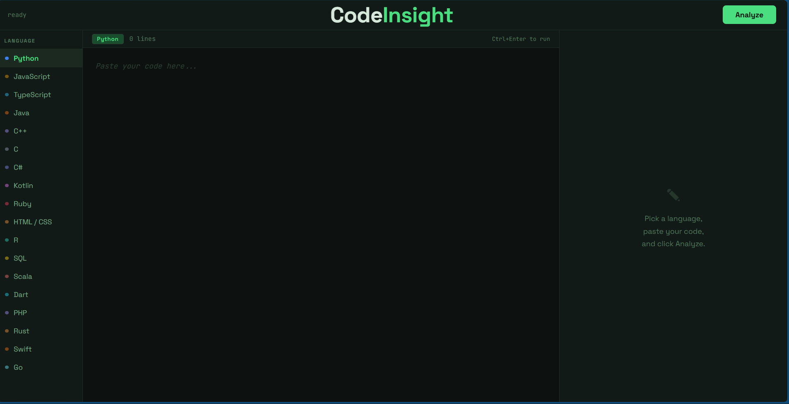

CodeInsight — Multi-Language Code Analyzer

A static analysis tool that scores code quality, detects smells, measures naturalness, and estimates AI-generated likelihood — across 18 programming languages.
Built with Python + Flask. No external analysis libraries — pure AST parsing for Python, pattern-based heuristics for all other languages.



#Features
Code Quality Scoring (0–100)
Every submission gets a weighted health score based on issue severity:
- Errors (−15 pts): security vulnerabilities, unsafe patterns, syntax issues
- Warnings (−5 pts): code smells, missing documentation, complexity spikes
- Info (−1 pt): style inconsistencies, minor suggestions


#Naturalness Score (0–100)
Measures how "human" the code reads by analyzing:
- Ratio of descriptive vs generic variable names (`userCount` vs `data`, `result`, `handler`)
- Naming convention consistency (flags mixed snake_case + camelCase)
- Logical use of blank lines and code structure
- Density of single-letter variables outside loop contexts


#AI Likelihood Score (0–100)
Detects patterns statistically common in AI-generated or copy-pasted code:
- High concentration of placeholder names (`data`, `obj`, `processData`, `handleResult`)
- Boilerplate-style comments (`# Step 1:`, `# This function...`, `# Returns...`)
- Suspiciously uniform line lengths across the file
- Every function having exactly one return statement (perfect symmetry)
- Mixed naming conventions — common when merging AI output with existing code


#Per-Issue Fix Hints
Every issue includes:
- A clear explanation of *why* it's a problem
- A concrete suggestion of *what* to do
- A collapsible code example showing the corrected version


#Metrics Panel
- Total lines / code lines / blank lines
- Function count
- Average cyclomatic complexity (Python)
- Maximum nesting depth
- Docstring / comment coverage percentage


#Supported Languages

| Language | Analyzer Type | Key Checks |

| Python | Full AST (stdlib `ast`) | Cyclomatic complexity, nesting depth, magic numbers, duplicate blocks, docstring coverage |
| JavaScript | Pattern-based | `var` vs `const`/`let`, loose equality `==`, callback nesting, console.log in production |
| TypeScript | Pattern-based | Same as JS + type-specific patterns |
| Java | Pattern-based | Raw generic types, `System.out.println`, missing Javadoc, public field exposure |
| C++ | Pattern-based | `using namespace std`, raw pointers vs smart pointers, missing include guards |
| C | Pattern-based | `gets()` unsafe, `malloc` without NULL check, `strcpy`/`strcat` buffer risks |
| C# | Pattern-based | Exception swallowing, `Console.WriteLine` in production, missing XML docs |
| Kotlin | Pattern-based | `!!` non-null assertions, `println` usage, mutable vs immutable collections |
| Ruby | Pattern-based | `eval()` security risk, `puts` in production, method length |
| Go | Pattern-based | Ignored errors (`_`), `panic()` usage, missing GoDoc on exported functions |
| Rust | Pattern-based | `.unwrap()` panic risk, `.clone()` overuse, missing doc comments, `panic!` macro |
| Swift | Pattern-based | Force unwrap `!`, retain cycles in delegates, missing access control |
| PHP | Pattern-based | SQL injection via `$_GET`/`$_POST`, XSS via unescaped echo, deprecated `mysql_*` |
| Dart | Pattern-based | `dynamic` type overuse, `print()` vs logger, `late` keyword overuse |
| Scala | Pattern-based | `null` vs `Option`, `var` vs `val`, explicit `return` (un-idiomatic) |
| SQL | Pattern-based | `SELECT *`, `UPDATE`/`DELETE` without `WHERE`, correlated subqueries, leading wildcard `LIKE` |
| R | Pattern-based | `=` vs `<-` assignment, `T`/`F` shorthand, `setwd()` portability, vector growing in loops |
| HTML/CSS | Pattern-based | Missing `alt` attributes, inline styles, deprecated tags, `!important` overuse |


#Project Structure
CodeInsight/
├── app.py              # Flask app — GET / and POST /analyze
├── analyzer.py         # All analysis logic — language dispatchers + shared helpers
├── templates/
│   └── index.html      # Single-page frontend (vanilla JS, no framework)
└── requirements.txt


#How it works
POST /analyze  { code: "...", language: "python" }
│
▼
analyzer.py → language dispatcher
│
├── Language-specific checks  (issues + raw metrics)
├── Secret/credential scan    (all languages)
└── Naturalness + AI scoring  (all languages)
│
▼
AnalysisResult dataclass → JSON response
│
▼
Frontend renders: score ring, metrics chips,
naturalness signals, AI signals,
issues sorted by severity with fix hints


#Getting Started
Requirements: Python 3.10+

```bash
# 1. Clone the repo
git clone https://github.com/manyahh07/CodeInsight.git
cd CodeInsight

# 2. Create and activate a virtual environment
python -m venv venv
source venv/bin/activate        # Linux/Mac
# venv\Scripts\activate         # Windows

# 3. Install dependencies
pip install flask

# 4. Run
python app.py
```

Open `http://127.0.0.1:5000` in your browser.

Keyboard shortcut: `Ctrl+Enter` inside the editor triggers analysis.


#API

The analyzer is accessible as a JSON API — callable from any frontend, CLI script, or CI pipeline.

Request
```http
POST /analyze
Content-Type: application/json

{
  "code": "def foo():\n    x = 1\n    return x",
  "language": "python"
}
```

Response
```json
{
  "score": 82,
  "language": "python",
  "naturalness_score": 74,
  "ai_likelihood_score": 30,
  "naturalness_reasons": [
    "Good use of descriptive, meaningful names."
  ],
  "ai_reasons": [
    "8 generic placeholder names detected."
  ],
  "metrics": {
    "total_lines": 45,
    "function_count": 4,
    "avg_complexity": 2.8,
    "max_nesting_depth": 3,
    "docstring_coverage": 50,
    "comment_ratio": 12
  },
  "issues": [
    {
      "severity": "warning",
      "category": "complexity",
      "message": "'process_data' has moderate complexity (7).",
      "line": 12,
      "suggestion": "Reduce nested conditionals using early returns.",
      "fix_hint": "if not valid: return\n# rest of logic"
    }
  ]
}
```


#Technical Notes
Python uses the standard library `ast` module for genuine AST-level analysis — it parses code into a syntax tree and walks nodes to compute cyclomatic complexity, detect magic numbers, identify single-letter variables outside loop targets, measure nesting depth, and check docstring coverage per function and class.
All other languages use regex and line-level pattern matching. This catches the most impactful, high-signal issues without requiring language runtimes or third-party parsers. The natural upgrade path is integrating [tree-sitter](https://tree-sitter.github.io/tree-sitter/) for true multi-language AST parsing.
The naturalness and AI likelihood scores are heuristic — they're useful signals, not definitive verdicts. They look at identifier vocabulary, comment style, structural symmetry, and naming consistency across the file.


#Roadmap
- [ ] `tree-sitter` integration for true AST analysis in all languages
- [ ] Git integration — churn rate, hotspot detection (complexity × churn)
- [ ] Trend analysis — compare score across multiple runs
- [ ] CLI mode: `python analyze.py myfile.py --format json`
- [ ] CI/CD mode: exit code 1 when score drops below a configurable threshold
- [ ] VS Code extension


#Contributing
Pull requests are welcome. To add a new language, create a function `_analyze_<language>(code: str, lines: list[str]) -> tuple[list[Issue], dict]` in `analyzer.py` and register it in the `LANGUAGE_ANALYZERS` dict at the bottom.


#License
MIT
